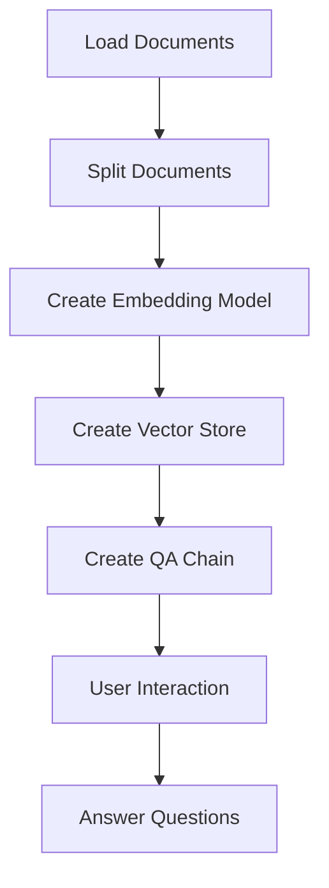

# Personal Assistant with LangChain

This project is a personal assistant built using LangChain, designed to interact with  personal documents, primarily in Markdown format. It utilizes machine learning models to answer questions based on the content of these documents.

## Table of Contents
- [Prerequisites](#prerequisites)
- [Project Structure](#project-structure)
- [Installation](#installation)
- [Loading Markdown Documents](#loading-markdown-documents)
- [Creating an Embedding Model](#creating-an-embedding-model)
- [Creating a Retrieval QA Chain](#creating-a-retrieval-qa-chain)
- [User Interaction](#user-interaction)
- [Running the Application](#running-the-application)
- [Next Steps](#next-steps)
- [Diagram](#diagram)

## Prerequisites

Ensure you have a Gitpod workspace initialized and that you have Python and Pip installed.

## Project Structure

The project should follow this structure:

```
your-project/
│
├── documents/            # Directory for your markdown documents
│   ├── doc1.md
│   ├── doc2.md
│
├── .gitpod.yml           # Gitpod configuration
├── .gitpod.Dockerfile    # Dockerfile for Gitpod environment
├── .env                  # Environment variables (for API keys)
├── app.py                # Main application code
└── requirements.txt      # Python dependencies
```

## Installation

Install LangChain and its dependencies by running the following command in the terminal:

```bash
pip install langchain[all] python-dotenv
```

## Loading Markdown Documents

In the `app.py`, create functions to load and split your Markdown documents:

```python
import os
from langchain.document_loaders import DirectoryLoader
from langchain.text_splitter import CharacterTextSplitter

# Load Markdown documents
def load_documents():
    loader = DirectoryLoader("documents", glob="*.md")
    documents = loader.load()
    return documents

# Split documents into manageable chunks
def split_documents(documents):
    text_splitter = CharacterTextSplitter(chunk_size=1000, chunk_overlap=200)
    return text_splitter.split_documents(documents)
```

## Creating an Embedding Model

You can create an embedding model to represent your documents as follows:

```python
from langchain.embeddings import OpenAIEmbeddings
from langchain.vectorstores import FAISS

# Initialize the embedding model
embeddings = OpenAIEmbeddings()

# Create a vector store for your document chunks
def create_vector_store(chunks):
    vector_store = FAISS.from_documents(chunks, embeddings)
    return vector_store
```

Set your OpenAI API key in the `.env` file:

```
OPENAI_API_KEY=your_api_key_here
```

Load the API key in your application:

```python
from dotenv import load_dotenv

load_dotenv()
```

## Creating a Retrieval QA Chain

To create a question-answering system, set up a Retrieval QA chain:

```python
from langchain.chains import RetrievalQA
from langchain.llms import OpenAI

# Create a retrieval QA chain
def create_qa_chain(vector_store):
    llm = OpenAI(temperature=0)  # Adjust temperature for randomness
    qa_chain = RetrievalQA.from_chain_type(llm, chain_type="stuff", retriever=vector_store.as_retriever())
    return qa_chain
```

## User Interaction

Implement user interaction with a simple loop:

```python
def main():
    documents = load_documents()
    chunks = split_documents(documents)
    vector_store = create_vector_store(chunks)
    qa_chain = create_qa_chain(vector_store)

    print("Welcome to your personal assistant! Ask me anything about your documents.")
    
    while True:
        question = input("You: ")
        if question.lower() in ["exit", "quit"]:
            break
        answer = qa_chain.run(question)
        print(f"Assistant: {answer}")

if __name__ == "__main__":
    main()
```

## Running the Application

Save the changes and run your application in the Gitpod terminal:

```bash
python app.py
```

You should now be able to ask questions based on the content of your Markdown documents.

## Next Steps
- Improve Document Processing: Explore different document loaders and text splitters.
- Customize the LLM: Experiment with different parameters and embeddings.
- Add More Features: Implement functionality for summarization or integrate with other APIs.
- Explore Other Models: Test different LLMs or frameworks.
- Testing and Deployment: Write tests and learn about deployment options.

## Diagram



---

This README provides an overview of the project, including setup instructions, code snippets, and future directions. 


