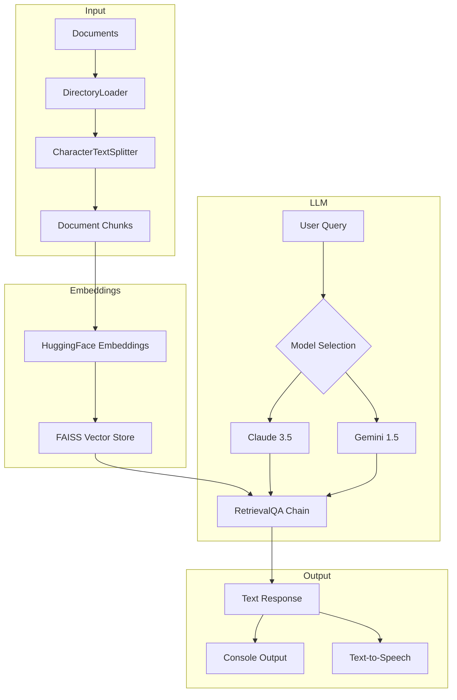

# Personal AI Assistant

A versatile command-line AI assistant that combines the power of Claude and Gemini models with document processing and text-to-speech capabilities. This assistant can understand context from your documents and provide natural, engaging responses while also offering voice output.

## Features

- 🤖 Dual AI Model Support: Switch between Claude 3.5 Sonnet and Gemini 1.5 Flash
- 📚 Document Processing: Loads and processes local documents for contextual responses
- 🔊 Text-to-Speech: Voice output support across different operating systems
- 🔄 Real-time Model Switching: Seamlessly switch between AI models during conversation
- 📝 Vector Store Integration: Uses FAISS for efficient document retrieval
- 🎯 Context-Aware Responses: Leverages document context for more accurate answers

## Prerequisites

- Python 3.8+
- An Anthropic API key (for Claude)
- A Google API key (for Gemini)

## Installation

1. Clone the repository:
```bash
git clone <repository-url>
cd personal-ai-assistant
```

2. Install required dependencies:
```bash
pip install -r requirements.txt
```

3. Create a `.env` file in the project root:
```env
ANTHROPIC_API_KEY=your_anthropic_api_key
GEMINI_API_KEY=your_gemini_api_key
```

## Usage

1. Place your documents in the `documents` directory (supports Markdown files by default)

2. Run the assistant:
```bash
python main.py
```

3. Interactive Commands:
- Type your questions or prompts naturally
- Type 'switch' to toggle between Claude and Gemini models
- Type 'exit' or 'quit' to end the session

## System Requirements

### Audio Support
- Windows: SAPI5
- macOS: NSSS
- Linux: espeak and ALSA utilities

### Linux Audio Setup
If you're using Linux and encounter audio issues:
```bash
sudo apt-get install espeak alsa-utils
sudo alsactl init
```

## Configuration

The assistant can be configured through the `AssistantConfig` class:

```python
config = AssistantConfig(
    llm_type=LLMType.GEMINI,  # or LLMType.CLAUDE
    chunk_size=1000,
    chunk_overlap=200,
    model_name="sentence-transformers/all-MiniLM-L6-v2",
    speech_enabled=True,
    documents_path="documents",
    documents_glob="*.md"
)
```

## System Architecture

